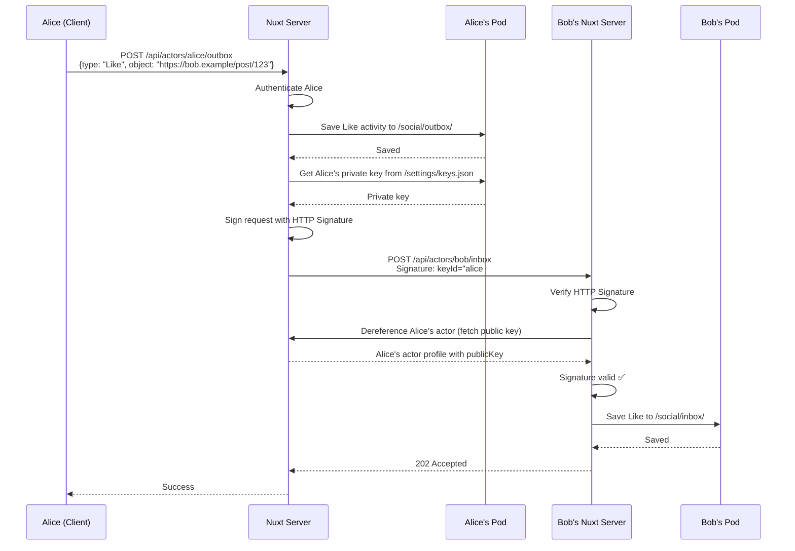

# OdyFeed

**A Decentralized Social Network Bridging ActivityPub Federation and Solid Pod Data Storage**

OdyFeed is an experimental social networking platform that demonstrates the convergence of two W3C standards: **ActivityPub** (for federated communication) and **Solid** (for decentralized personal data storage). Unlike traditional social networks or pure ActivityPub implementations, OdyFeed stores user data in personal Solid Pods while maintaining compatibility with the broader Fediverse.

---

## Table of Contents

1. [High-Level Architecture & Philosophy](#high-level-architecture--philosophy)
2. [Architectural Decision Records: The "Why"](#architectural-decision-records-the-why)
3. [Deep Dive: ActivityPub Implementation](#deep-dive-activitypub-implementation)
4. [Deep Dive: Solid Pod Integration](#deep-dive-solid-pod-integration)
5. [Data Flow: End-to-End Example](#data-flow-end-to-end-example)
6. [Project Structure](#project-structure)
7. [Setup & Development](#setup--development)
8. [Environment Configuration](#environment-configuration)
9. [Troubleshooting & Common Pitfalls](#troubleshooting--common-pitfalls)
10. [Testing & Verification](#testing--verification)

---

## High-Level Architecture & Philosophy

### What Does OdyFeed Do?

OdyFeed is a **social media platform** where:
- Users authenticate using **Solid OIDC** (OpenID Connect) against their chosen Solid Pod provider
- User profiles, posts, and social graph data are stored in **personal Solid Pods** (not on a centralized server)
- The application federates with other ActivityPub servers (Mastodon, Pleroma, etc.) through standardized protocols
- The Nuxt server acts as a **proxy/gateway** that translates between Solid Pod storage and ActivityPub federation

### Why This Architecture?

#### The Problem
Modern social networks face a trilemma:
1. **Centralization**: User data is owned by corporations (Facebook, Twitter)
2. **Federation without Ownership**: ActivityPub servers (Mastodon) federate but still control your data centrally on their instance
3. **Data Ownership without Network Effects**: Solid gives you a personal data pod, but lacks social networking infrastructure

#### The Solution: OdyFeed's Hybrid Approach

OdyFeed combines the best of both worlds:

| Component | Technology | Purpose |
|-----------|-----------|---------|
| **Identity & Auth** | Solid OIDC | Decentralized authentication, WebID-based identity |
| **Data Storage** | Solid Pods (LDP) | User owns their data (posts, likes, follows) in their personal pod |
| **Social Protocol** | ActivityPub | Federated communication with existing Fediverse instances |
| **Application Layer** | Nuxt 3 (SSR disabled) | Client-side SPA with Nitro server as AP/Solid gateway |

#### Why Nuxt?
- **Unified Codebase**: Single TypeScript project for client and server
- **Nitro Server**: Lightweight H3-based server perfect for handling ActivityPub HTTP signatures and Solid authentication
- **SSR Disabled**: Client-side rendering ensures sensitive operations (Pod access) happen with user authentication tokens
- **Type Safety**: Shared types between client and server reduce integration bugs

#### Why Combine ActivityPub + Solid?
**ActivityPub** provides:
- ✅ Standardized federation protocol (existing network effects with Mastodon, Pleroma, etc.)
- ✅ Push-based delivery (server-to-server communication)
- ✅ Well-defined Actor/Inbox/Outbox model

**Solid** provides:
- ✅ True data ownership (user controls storage location)
- ✅ Fine-grained access control (ACLs on Pod resources)
- ✅ Interoperability (other apps can read your OdyFeed data with permission)

**The Gap**: ActivityPub servers expect centralized storage; Solid Pods are personal data stores. OdyFeed bridges this gap by:
1. Storing all user content in Solid Pods (RDF/JSON-LD)
2. Serving ActivityPub endpoints that dynamically read from Pods
3. Signing requests with private keys stored in Pods
4. Translating between Solid's RDF-based data model and ActivityPub's JSON-LD

---

## System Architecture Diagram

```mermaid
graph TB
    subgraph "Client (Browser)"
        A[Nuxt SPA]
        A1[Auth Store]
        A2[Pinia Colada Queries]
        A3[Vue Components]
    end

    subgraph "Nuxt Nitro Server (Gateway)"
        B[API Routes]
        B1[/api/auth/*]
        B2[/api/actors/:username/*]
        B3[/api/timeline]
        B4[/api/webmentions]
        
        C[Server Utils]
        C1[solidSession.ts]
        C2[federation.ts]
        C3[podStorage.ts]
        C4[httpSignature.ts]
    end

    subgraph "User's Solid Pod"
        D[Pod Storage]
        D1[/social/inbox/]
        D2[/social/outbox/]
        D3[/profile/activitypub]
        D4[/settings/keys.json]
    end

    subgraph "ActivityPub Federation"
        E[Remote Instances]
        E1[Mastodon]
        E2[Pleroma]
        E3[Other AP Servers]
    end

    subgraph "Solid OIDC Provider"
        F[Identity Provider]
        F1[login.inrupt.com]
        F2[solidcommunity.net]
    end

    A --> B
    A1 -->|Auth Token| B1
    A2 -->|Fetch Data| B2
    A2 -->|Fetch Timeline| B3
    
    B1 -->|OAuth Flow| F
    B1 <-->|DPoP Tokens| C1
    C1 <-->|Authenticated Fetch| D
    
    B2 -->|Read Profile| C3
    B2 -->|Read Posts| C3
    C3 <-->|@inrupt/solid-client| D
    
    B2 -->|Federate Activity| C2
    C2 -->|HTTP Signature| C4
    C2 -->|POST to Inbox| E
    
    E -->|POST Follow/Like| B2
    B2 -->|Verify Signature| C4
    B2 -->|Save to Inbox| C3
    C3 -->|Store Activity| D1
    
    D4 -->|Private Key| C4
    
    style D fill:#90EE90
    style F fill:#87CEEB
    style E fill:#FFB6C1
    style B fill:#FFE4B5
```

---

## Architectural Decision Records: The "Why"

### ADR-001: Why Store ActivityPub Data in Solid Pods?

**Decision**: Use Solid Pods as the primary data store instead of a traditional database.

**Context**: 
- ActivityPub servers typically use PostgreSQL/MySQL to store user data
- Solid provides standardized RDF-based storage with built-in access control

**Consequences**:
- ✅ **Pro**: Users truly own their data and can move between OdyFeed instances
- ✅ **Pro**: Data can be accessed by other Solid-compatible apps
- ✅ **Pro**: No database migrations or server-side storage costs
- ❌ **Con**: Performance overhead (network latency to fetch from Pod)
- ❌ **Con**: Complexity in translating RDF ↔ ActivityPub JSON-LD

**Rationale**: The long-term value of data portability and user sovereignty outweighs the performance trade-offs for a proof-of-concept platform.

---

### ADR-002: Why Use @inrupt/solid-client-authn-node for Server-Side Auth?

**Decision**: Use Inrupt's Node.js Solid authentication library with persistent DPoP key storage.

**Context**:
- Solid uses DPoP (Demonstrating Proof of Possession) tokens tied to cryptographic keys
- Server must maintain authenticated sessions to read/write user Pods
- DPoP keys must persist across requests to avoid "accountId mismatch" errors

**Consequences**:
- ✅ **Pro**: Official library with robust OIDC + DPoP handling
- ✅ **Pro**: Automatic token refresh with `Session.events.on('newTokens')`
- ❌ **Con**: Complex session hydration (see `server/utils/solidSession.ts`)
- ❌ **Con**: Memory management for active sessions

**Implementation Details**:
```typescript
// Persistent storage ensures DPoP keys survive across requests
const storage = getSharedSolidStorage() // Disk-backed storage
const session = new Session({ storage, keepAlive: true })
```

---

### ADR-003: Why RSA-SHA256 for HTTP Signatures?

**Decision**: Use RSA-2048 key pairs and `rsa-sha256` algorithm for ActivityPub HTTP Signatures.

**Context**:
- ActivityPub federation requires cryptographic proof of message origin
- Most implementations (Mastodon, Pleroma) support `rsa-sha256`

**Library Choice**: Native Node.js `crypto` module instead of third-party libraries.

**Rationale**:
- Reduces dependencies and supply chain attack surface
- `crypto.createSign()` and `crypto.createVerify()` are battle-tested
- Custom implementation allows fine-grained control over signature format

**Security Note**: Private keys are stored in the user's Solid Pod at `/settings/keys.json` with ACL restricted to the Pod owner.

---

### ADR-004: Why JSON-LD Instead of Pure RDF/Turtle?

**Decision**: Store ActivityPub activities as JSON-LD in Pods (not Turtle).

**Context**:
- Solid natively supports Turtle (RDF serialization)
- ActivityPub uses JSON-LD (RDF in JSON format)

**Rationale**:
- Preserves ActivityPub structure without lossy RDF conversion
- Easier debugging (JSON is human-readable)
- Direct pass-through from Pod → ActivityPub inbox
- Profile metadata still uses Turtle for Solid compatibility

---

### ADR-005: Why SSR Disabled (Client-Side Only)?

**Decision**: Nuxt configured with `ssr: false` in `nuxt.config.ts`.

**Context**:
- Solid authentication requires browser-based OAuth flows
- Sensitive Pod operations need user's access tokens

**Consequences**:
- ✅ **Pro**: Authentication state managed client-side (no server session complexity for UI)
- ✅ **Pro**: Access tokens never sent to Nuxt server (better security model)
- ❌ **Con**: No SEO benefits for public posts
- ❌ **Con**: Initial page load requires JavaScript

**Mitigation**: Public ActivityPub endpoints (`/api/actors/:username`) still work server-side for federation.

---

## Deep Dive: ActivityPub Implementation

### The Actor Model

**What is an Actor?**
In ActivityPub, an "Actor" represents a user/service that can send and receive activities. Each actor has:
- A unique `id` (URL, e.g., `https://odyfeed.example.com/api/actors/alice`)
- An `inbox` (receives messages from others)
- An `outbox` (publishes activities to followers)
- A public key (for HTTP signature verification)

**OdyFeed's Actor Profile Structure**:
```typescript
interface ASActor {
  "@context": "https://www.w3.org/ns/activitystreams",
  "id": "https://odyfeed.example.com/api/actors/alice",
  "type": "Person",
  "preferredUsername": "alice",
  "name": "Alice Wonder",
  "inbox": "https://odyfeed.example.com/api/actors/alice/inbox",
  "outbox": "https://odyfeed.example.com/api/actors/alice/outbox",
  "publicKey": {
    "id": "https://odyfeed.example.com/api/actors/alice#main-key",
    "owner": "https://odyfeed.example.com/api/actors/alice",
    "publicKeyPem": "-----BEGIN PUBLIC KEY-----\n..."
  }
}
```

**Key Implementation Files**:
- `server/api/actors/[username]/index.get.ts` - Serves actor profile
- `server/utils/actorHelpers.ts` - `createActorProfile()` function
- `server/utils/crypto.ts` - RSA key pair generation

---

### Inbox/Outbox Flow

#### Inbox (Receiving Activities)

**Endpoint**: `POST /api/actors/:username/inbox`

**Flow**:
1. Remote server sends activity (e.g., Follow, Like) with HTTP Signature
2. `verifyHttpSignature()` fetches sender's public key and validates signature
3. Activity is saved to user's Solid Pod at `/social/inbox/:activityId.json`
4. Special handling for Follow requests: auto-send Accept activity

**Code Walkthrough** (`server/api/actors/[username]/inbox.post.ts`):
```typescript
// 1. Verify HTTP Signature
const { verified, actorId } = await verifyHttpSignature(event, bodyString)
if (!verified) throw createError({ statusCode: 401 })

// 2. Save to Solid Pod
const savedUrl = await saveActivityToPod(webId, inboxContainer, activity, slug)

// 3. Handle Follow activities
if (activity.type === 'Follow') {
  const acceptActivity = generateAcceptActivity(activity, actorId, actorId)
  const followerActor = await dereferenceActor(activity.actor)
  await sendActivityToInbox(followerActor.inbox, acceptActivity, actorId, privateKey)
}
```

**HTTP Signature Verification** (`server/utils/httpSignature.ts`):
- Parses `Signature` header to extract `keyId`, `algorithm`, `headers`, `signature`
- Fetches public key from remote actor's profile
- Reconstructs signing string from HTTP headers
- Verifies signature using `crypto.createVerify()`

---

#### Outbox (Sending Activities)

**Endpoint**: `POST /api/actors/:username/outbox`

**Flow**:
1. Client sends activity (e.g., Create Note, Like) to outbox
2. Activity is saved to Solid Pod at `/social/outbox/:activityId.json`
3. Server extracts recipients from `to` and `cc` fields
4. For each recipient, dereference their actor profile to get inbox URL
5. Sign request with user's private key
6. POST activity to each recipient's inbox

**Code Walkthrough** (`server/api/actors/[username]/outbox.post.ts`):
```typescript
// 1. Validate ownership
if (username !== authUsername) throw createError({ statusCode: 403 })

// 2. Save to Pod
const savedUrl = await saveActivityToPod(webId, outboxContainer, activity, slug)

// 3. Get private key from Pod
const privateKey = await getPrivateKeyFromPod(webId, podUrl)

// 4. Federate to recipient inboxes
const federationResult = await federateActivity(activity, actorId, privateKey)
```

**Federation Logic** (`server/utils/federation.ts`):
```typescript
export const federateActivity = async function (
  activity: ASActivity,
  senderActorId: string,
  privateKey: string
) {
  // Resolve all recipient inbox URLs
  const inboxes = await resolveRecipientInboxes(to, cc)
  
  // Send to each inbox in parallel
  const results = await Promise.allSettled(
    inboxes.map(inbox => sendActivityToInbox(inbox, activity, senderActorId, privateKey))
  )
  
  return { total, successful, failed }
}
```

---

### HTTP Signature Generation

**Signing Algorithm** (RFC 8017 - PKCS#1 v2.2):
```typescript
// server/utils/crypto.ts
export const signRequest = function (params: SignRequestParams) {
  const { privateKey, keyId, url, method, body } = params
  
  // 1. Build signing string
  const stringToSign = `(request-target): ${method.toLowerCase()} ${path}\nhost: ${host}\ndate: ${date}\ndigest: ${digest}`
  
  // 2. Sign with RSA-SHA256
  const signer = createSign('sha256')
  signer.update(stringToSign)
  const signature = signer.sign(privateKey, 'base64')
  
  // 3. Build Signature header
  return {
    'Host': host,
    'Date': date,
    'Digest': `SHA-256=${digest}`,
    'Signature': `keyId="${keyId}",algorithm="rsa-sha256",headers="${headers}",signature="${signature}"`
  }
}
```

**Why These Headers?**
- `(request-target)`: Prevents replay attacks on different endpoints
- `Host`: Prevents attacks redirecting to different domains
- `Date`: Prevents replay attacks (many servers reject >5min old signatures)
- `Digest`: Ensures body integrity (prevents tampering)

---

### ActivityPub Collections

**Paginated Collections** (Inbox/Outbox/Followers):

OdyFeed implements ordered collections per ActivityPub spec:
```json
{
  "@context": "https://www.w3.org/ns/activitystreams",
  "id": "https://odyfeed.example.com/api/actors/alice/outbox",
  "type": "OrderedCollection",
  "totalItems": 42,
  "first": "https://odyfeed.example.com/api/actors/alice/outbox?page=1"
}
```

**Page Response**:
```json
{
  "id": "https://odyfeed.example.com/api/actors/alice/outbox?page=1",
  "type": "OrderedCollectionPage",
  "partOf": "https://odyfeed.example.com/api/actors/alice/outbox",
  "orderedItems": [ /* activities */ ],
  "next": "https://odyfeed.example.com/api/actors/alice/outbox?page=2"
}
```

**Implementation**: `server/utils/actorEndpointHelpers.ts` - `buildCollection()` helper

---

## Deep Dive: Solid Pod Integration

### Solid OIDC Authentication Flow

**Phase 1: Client-Side Login Initiation** (`app/stores/authStore.ts`):
1. User selects Solid provider (e.g., `login.inrupt.com`)
2. Client fetches OIDC configuration from `/.well-known/openid-configuration`
3. Client redirects to Nuxt server's `/api/auth/login?issuer=...`

**Phase 2: Server-Side OAuth Flow** (`server/api/auth/login.get.ts`):
```typescript
const session = new Session({ storage: persistentStorage })
await session.login({
  oidcIssuer: issuer,
  redirectUrl: `${baseUrl}/api/auth/callback`,
  clientName: "OdyFeed",
  handleRedirect: (url) => sendRedirect(event, url)
})
```

**Critical Detail**: The `Session` object stores DPoP (Demonstrating Proof of Possession) cryptographic keys in `storage`. These keys MUST persist across the OAuth callback to avoid "accountId mismatch" errors.

**Phase 3: OAuth Callback** (`server/api/auth/callback.get.ts`):
```typescript
// Recover the SAME session instance (with DPoP keys)
const session = pendingSessions.get(tempSessionId)

// Complete OAuth flow
await session.handleIncomingRedirect(url.toString())

// Extract tokens
const { webId, sessionId } = session.info
```

**Phase 4: Session Persistence**:
- Session data stored in `data/sessions/` directory
- WebID-to-username mapping stored in `data/users/webid-mappings.json`
- Solid session data (including DPoP keys) stored in `data/solid-sessions/`

---

### Pod Container Structure

When a user registers, OdyFeed initializes these containers in their Solid Pod:

```
<POD_URL>/
├── social/
│   ├── inbox/          # Incoming ActivityPub activities
│   ├── outbox/         # Outgoing ActivityPub activities
│   ├── followers/      # List of followers
│   ├── following/      # List of accounts user follows
│   └── activities/     # Private activity metadata
├── profile/
│   ├── card            # RDF profile (vCard, FOAF)
│   └── activitypub     # ActivityPub Actor JSON-LD
└── settings/
    ├── keys.json       # Private RSA key
    ├── publicTypeIndex.ttl
    └── privateTypeIndex.ttl
```

**Implementation**: `server/utils/podStorage.ts` - `ensurePodContainers()`

---

### Access Control (ACL)

Each container has specific permissions:

| Container | Permission Type | Public Read? | Public Write? |
|-----------|----------------|--------------|---------------|
| `/social/inbox/` | PublicAppendPrivateRead | ❌ No | ✅ Append only |
| `/social/outbox/` | PublicReadOwnerWrite | ✅ Yes | ❌ Owner only |
| `/profile/` | PublicReadOwnerWrite | ✅ Yes | ❌ Owner only |
| `/settings/` | PrivateOwnerOnly | ❌ No | ❌ Owner only |

**Why PublicAppendPrivateRead for Inbox?**
- Remote ActivityPub servers need to POST activities (append)
- Only the owner should read their inbox (privacy)
- Prevents inbox snooping by third parties

**ACL Generation** (`server/utils/aclGenerator.ts`):
```turtle
@prefix acl: <http://www.w3.org/ns/auth/acl#>.
@prefix foaf: <http://xmlns.com/foaf/0.1/>.

<#public>
  a acl:Authorization;
  acl:accessTo <./>;
  acl:agentClass foaf:Agent;
  acl:mode acl:Append.

<#owner>
  a acl:Authorization;
  acl:accessTo <./>;
  acl:agent <https://pod.example/user#me>;
  acl:mode acl:Read, acl:Write, acl:Control.
```

---

### Reading/Writing to Pods

**Library**: `@inrupt/solid-client` for LDP (Linked Data Platform) operations

**Write Example** (Saving Activity):
```typescript
// server/utils/podStorage.ts
const authenticatedFetch = await getAuthenticatedFetch(webId)
const activityBlob = new Blob([JSON.stringify(activity)], { type: 'application/ld+json' })
const savedFile = await saveFileInContainer(
  containerUrl,
  activityBlob,
  { slug, fetch: authenticatedFetch }
)
```

**Read Example** (Fetching Activity):
```typescript
const file = await getFile(activityUrl, { fetch: authenticatedFetch })
const text = await file.text()
const activity = JSON.parse(text)
```

**List Container** (Inbox/Outbox pagination):
```typescript
const dataset = await getSolidDataset(containerUrl, { fetch: authenticatedFetch })
const urls = getContainedResourceUrlAll(dataset)
```

---

### Session Hydration (Server-Side Pod Access)

**Challenge**: Server needs to access user's Pod without the user being actively logged in.

**Solution**: Store refresh tokens and hydrate sessions on-demand.

**Implementation** (`server/utils/solidSession.ts`):
```typescript
export const hydrateSession = async function (webId: string) {
  const userData = await getUserSession(webId)
  const storage = getSharedSolidStorage()
  const session = new Session({ storage })
  
  await session.login({
    oidcIssuer: userData.issuer,
    clientId: userData.clientId,
    clientSecret: userData.clientSecret,
    refreshToken: userData.refreshToken,
  })
  
  // Listen for token refresh
  session.events.on('newTokens', (tokenSet) => {
    saveUserSession(webId, { ...userData, refreshToken: tokenSet.refreshToken })
  })
  
  activeSessions.set(webId, session)
  return session
}
```

**Token Refresh**: Solid providers issue short-lived access tokens (~15min). The `Session` object automatically refreshes tokens using the refresh token before they expire.

---

### RDF Ontology Used

**Profile Data** (Turtle format):
```turtle
@prefix foaf: <http://xmlns.com/foaf/0.1/>.
@prefix vcard: <http://www.w3.org/2006/vcard/ns#>.

<#me>
  a foaf:Person;
  foaf:name "Alice Wonder";
  vcard:hasEmail <mailto:alice@example.com>.
```

**ActivityPub Profile** (JSON-LD in Pod):
```json
{
  "@context": "https://www.w3.org/ns/activitystreams",
  "id": "https://odyfeed.example.com/api/actors/alice",
  "type": "Person",
  "name": "Alice Wonder"
}
```

**Why Both Formats?**
- **Turtle**: Solid ecosystem interoperability (other Solid apps can read vCard data)
- **JSON-LD**: ActivityPub compatibility (direct serving to federation)

---

## Data Flow: End-to-End Example

### Scenario: Alice Likes Bob's Post



---

## Project Structure

```
OdyFeed/
├── app/                          # Nuxt client-side application
│   ├── api/                      # Client API wrappers
│   │   ├── activities.ts         # Create Like/Reply activities
│   │   ├── actors.ts             # Fetch actor profiles
│   │   ├── auth.ts               # Registration API
│   │   └── timeline.ts           # Fetch timeline posts
│   ├── assets/css/               # Global styles
│   ├── components/               # Vue components
│   │   ├── atoms/                # Base UI components
│   │   ├── molecules/            # Composite components
│   │   ├── organisms/            # Complex layouts
│   │   ├── Actor/                # Actor-related components
│   │   ├── Post/                 # Post display components
│   │   ├── Reply/                # Reply components
│   │   ├── Webmention/           # Webmention display
│   │   ├── AppHeader.vue         # Navigation header
│   │   ├── AppFooter.vue         # Page footer
│   │   ├── LoginModal.vue        # Solid OIDC login UI
│   │   └── RegistrationModal.vue # User registration form
│   ├── composables/              # Reusable composition functions
│   │   ├── useAuth.ts            # Authentication state wrapper
│   │   ├── useAuthProviders.ts   # Solid provider list
│   │   ├── useFormValidation.ts  # Form validation logic
│   │   ├── useModal.ts           # Modal state management
│   │   ├── usePostActions.ts     # Like/reply/delete actions
│   │   └── useWebmentions.ts     # Webmention data
│   ├── layouts/
│   │   └── default.vue           # Default page layout
│   ├── middleware/
│   │   └── auth.ts               # Route protection
│   ├── mutations/                # Pinia Colada mutations (writes)
│   │   ├── auth.ts               # Login/register mutations
│   │   ├── like.ts               # Like post mutation
│   │   ├── reply.ts              # Reply to post mutation
│   │   └── webmention.ts         # Send webmention mutation
│   ├── pages/                    # Route pages
│   │   ├── index.vue             # Home timeline
│   │   ├── about.vue             # About page
│   │   ├── callback.vue          # OAuth callback handler
│   │   ├── inbox.vue             # User inbox view
│   │   ├── profile.vue           # User profile page
│   │   ├── register.vue          # Registration page
│   │   ├── setup.vue             # Initial setup wizard
│   │   └── actors/
│   │       └── [username].vue    # Public actor profile
│   ├── plugins/
│   │   ├── auth-session.client.ts # Auth session initialization
│   │   └── solid-vcard.client.ts  # Solid vCard web component
│   ├── queries/                  # Pinia Colada queries (reads)
│   │   ├── auth.ts               # Auth status query
│   │   ├── inbox.ts              # User inbox query
│   │   ├── post.ts               # Single post query
│   │   ├── replies.ts            # Post replies query
│   │   ├── timeline.ts           # Timeline query
│   │   └── webmentions.ts        # Webmentions query
│   ├── stores/
│   │   └── authStore.ts          # Pinia auth state (central store)
│   ├── types/
│   │   ├── index.ts              # Shared types
│   │   └── oidc.ts               # OIDC-specific types
│   └── utils/
│       ├── fetch.ts              # HTTP headers helpers
│       ├── authHelper.ts    # Mutation utilities
│       ├── oidc.ts               # PKCE challenge generation
│       ├── postHelpers.ts        # Post formatting utilities
│       ├── queryKeys.ts          # Query key factory
│       ├── rdf.ts                # RDF parsing (client-side)
│       └── solidHelpers.ts       # Solid utility functions
│
├── server/                       # Nuxt Nitro server (ActivityPub gateway)
│   ├── api/                      # API endpoints
│   │   ├── actors/
│   │   │   └── [username]/
│   │   │       ├── index.get.ts  # Actor profile (ActivityPub Actor object)
│   │   │       ├── inbox.get.ts  # Inbox collection (requires auth)
│   │   │       ├── inbox.post.ts # Receive federated activities
│   │   │       ├── outbox.get.ts # Outbox collection (public)
│   │   │       ├── outbox.post.ts # Send new activities
│   │   │       ├── posts.get.ts  # List user's posts
│   │   │       ├── followers.get.ts # Followers collection
│   │   │       ├── following.get.ts # Following collection
│   │   │       └── status/
│   │   │           └── [statusId].get.ts # Single post
│   │   ├── auth/
│   │   │   ├── callback.get.ts   # OAuth callback handler
│   │   │   ├── login.get.ts      # Initiate OIDC login
│   │   │   ├── logout.post.ts    # Logout endpoint
│   │   │   ├── me.get.ts         # Get current user
│   │   │   ├── register.post.ts  # Register new user
│   │   │   └── status.get.ts     # Auth status check
│   │   ├── timeline.get.ts       # Aggregated timeline
│   │   └── webmentions/
│   │       ├── index.get.ts      # List webmentions
│   │       └── index.post.ts     # Receive webmention
│   ├── middleware/               # Server middleware
│   │   └── auth.ts               # Inject auth context
│   └── utils/                    # Server utilities
│       ├── aclGenerator.ts       # Generate Solid ACL rules
│       ├── actorEndpointHelpers.ts # ActivityPub collection builders
│       ├── actorHelpers.ts       # Actor profile generation
│       ├── authHelpers.ts        # Auth validation
│       ├── crypto.ts             # RSA key generation, HTTP signing
│       ├── federation.ts         # ActivityPub federation logic
│       ├── fileStorage.ts        # Local file storage wrapper
│       ├── httpSignature.ts      # HTTP Signature verification
│       ├── logger.ts             # Structured logging
│       ├── microformats.ts       # Webmention microformat parsing
│       ├── podStorage.ts         # Solid Pod read/write operations
│       ├── postGenerator.ts      # Generate mythological posts
│       ├── rdf.ts                # RDF/Turtle parsing
│       ├── sessionCookie.ts      # Session cookie management
│       ├── sessionStorage.ts     # Session persistence
│       ├── solidSession.ts       # Solid Session hydration
│       ├── solidStorage.ts       # Solid storage backend
│       └── typeIndexGenerator.ts # Generate Solid Type Indexes
│
├── shared/                       # Shared between client & server
│   ├── constants.ts              # Namespaces, endpoints, defaults
│   └── types/
│       ├── activitypub.ts        # ActivityPub interfaces
│       ├── api.ts                # API request/response types
│       ├── solid.ts              # Solid ACL types
│       ├── webmention.ts         # Webmention types
│       └── mappers.ts            # Data transformation utilities
│
├── data/                         # Runtime data (not in version control)
│   ├── sessions/                 # User session metadata
│   ├── solid-sessions/           # Solid session storage (DPoP keys)
│   └── users/
│       └── webid-mappings.json   # WebID → username → actorId mappings
│
├── public/                       # Static assets
│   ├── actors.ttl                # Mythological actors (Greek gods)
│   ├── events.ttl                # Mythological events
│   ├── vocab.ttl                 # Custom RDF vocabulary
│   ├── favicon.ico
│   └── robots.txt
│
├── logs/                         # Application logs
│   └── activitypub.log
│
├── nuxt.config.ts                # Nuxt configuration
├── tsconfig.json                 # TypeScript configuration
├── package.json                  # Dependencies
└── .env                          # Environment variables
```

### Key Directories Explained

#### ActivityPub Logic: `server/api/actors/`
All ActivityPub federation endpoints live here. The `[username]` dynamic route handles:
- Actor profile serving
- Inbox/Outbox collections
- Individual status (post) retrieval

#### Solid Integration: `server/utils/podStorage.ts` + `solidSession.ts`
- `podStorage.ts`: High-level Pod operations (save/read activities, create containers)
- `solidSession.ts`: Session management, token refresh, authenticated fetch

#### Federation Core: `server/utils/federation.ts`
- `dereferenceActor()`: Fetch remote actor profiles
- `resolveRecipientInboxes()`: Find all inboxes for a list of recipients
- `sendActivityToInbox()`: Sign and POST activities
- `federateActivity()`: Orchestrate delivery to multiple inboxes

#### Client Data Layer: `app/queries/` + `app/mutations/`
- **Queries** (Pinia Colada): Cached data fetching with automatic refetching
- **Mutations**: Optimistic updates and cache invalidation
- Separation of concerns: queries are read-only, mutations modify state

---

## Setup & Development

### Prerequisites

- **Node.js**: v18.0.0 or higher (v20.x recommended)
- **pnpm**: v8.0.0 or higher (faster than npm)
- **Solid Pod**: Create an account at one of these providers:
  - [Inrupt PodSpaces](https://login.inrupt.com) (recommended for testing)
  - [SolidCommunity.net](https://solidcommunity.net)
  - [SolidWeb.org](https://solidweb.org)

### Installation

```powershell
# 1. Clone repository
git clone https://github.com/yourusername/OdyFeed.git
cd OdyFeed

# 2. Install dependencies
pnpm install

# 3. Create environment file
Copy-Item .env.example .env

# 4. Edit .env file
# Set BASE_URL to http://localhost:3000 for local development
notepad .env
```

### Development Server

```powershell
pnpm dev
```

Visit `http://localhost:3000`

**First-Time Setup**:
1. Click "Login" in the header
2. Select a Solid provider (e.g., Inrupt PodSpaces)
3. Authorize OdyFeed to access your Pod
4. Fill in registration form:
   - Username (alphanumeric, lowercase)
   - Display name
   - Bio (optional)
5. Click "Create Profile"

**What Happens Behind the Scenes**:
- Pod containers are created (`/social/`, `/profile/`, `/settings/`)
- RSA key pair is generated and private key saved to Pod
- Actor profile is saved to Pod and mapped to your WebID
- Sample posts are generated (optional, for testing)

---

## Environment Configuration

### `.env` File

```bash
# Application Base URL
# CRITICAL: Must match your deployment URL for OAuth callbacks to work
BASE_URL=http://localhost:3000

# OpenAI API Key (optional - for AI-generated content)
# Get your key from: https://platform.openai.com/api-keys
OPENAI_API_KEY=sk-...

# ActivityPub Pagination (optional)
ACTIVITYPUB_PAGE_SIZE=20
```

### Production Deployment Considerations

#### HTTPS is MANDATORY
ActivityPub federation requires HTTPS. Most servers will reject connections to `http://` URLs.

**Options**:
1. **Reverse proxy** (Nginx/Caddy with Let's Encrypt)
2. **Platform-provided HTTPS** (Vercel, Netlify, Railway)
3. **Tunnel for testing** (ngrok, Cloudflare Tunnel)

#### ngrok Example (Development/Testing)

```powershell
# Terminal 1: Start Nuxt dev server
pnpm dev

# Terminal 2: Start ngrok tunnel
ngrok http 3000
```

**Update `.env`**:
```bash
BASE_URL=https://your-random-id.ngrok-free.app
```

**Restart dev server** after changing `BASE_URL` (clientid.json is regenerated).

#### CORS Considerations with Solid Providers

**Problem**: Solid Pod providers may block CORS requests from ngrok domains.

**Solution 1** (Recommended): Use Inrupt PodSpaces - they whitelist common tunnel domains.

**Solution 2**: Deploy to a real domain (even a subdomain works).

**Solution 3**: For testing, use localhost with a local Solid server (Community Solid Server).

---

### clientid.json (Auto-Generated)

The `public/clientid.json` file is automatically generated from `BASE_URL`:

```json
{
  "client_id": "https://your-domain.com/clientid.json",
  "redirect_uris": ["https://your-domain.com/api/auth/callback"],
  "client_name": "OdyFeed",
  "client_uri": "https://your-domain.com",
  "logo_uri": "https://your-domain.com/favicon.ico",
  "tos_uri": "https://your-domain.com/terms",
  "policy_uri": "https://your-domain.com/privacy",
  "software_id": "odyfeed",
  "software_version": "1.0.0",
  "token_endpoint_auth_method": "client_secret_basic",
  "grant_types": ["authorization_code", "refresh_token"],
  "response_types": ["code"]
}
```

This file is served at `/clientid.json` and tells Solid providers how to configure OAuth for OdyFeed.

---

## Troubleshooting & Common Pitfalls

### 1. "accountId mismatch" Error During OAuth Callback

**Symptom**: OAuth callback fails with cryptic error about DPoP key mismatch.

**Cause**: The `Session` object used in callback doesn't have the same DPoP keys as the one used in login.

**Fix**: Ensure `pendingSessions` map is correctly tracking session instances.

**Verification**:
```powershell
# Check server logs for:
# "✅ Recovered pending session from memory"
# "DPoP key in storage: ✅ FOUND"
```

**Prevention**: Don't restart the dev server between login and callback. If you must, implement disk-based pending session recovery.

---

### 2. HTTP Signature Verification Fails

**Symptom**: Remote servers reject your federated activities with 401/403.

**Common Causes**:
1. **Clock skew**: Your server's clock is >5 minutes off
2. **Wrong key format**: Private key not PEM-encoded PKCS#8
3. **Body mismatch**: `Digest` header doesn't match request body

**Debug Steps**:
```powershell
# 1. Check server time
Get-Date

# 2. Enable debug logging
# In .env:
LOG_LEVEL=debug

# 3. Check signature generation
# Logs will show: "Signing string: ..."
```

**Test Signature Locally**:
```powershell
# Send activity to yourself
curl -X POST http://localhost:3000/api/actors/alice/inbox `
  -H "Content-Type: application/ld+json" `
  -H "Signature: keyId=\"http://localhost:3000/api/actors/alice#main-key\",algorithm=\"rsa-sha256\",headers=\"(request-target) host date digest\",signature=\"...\"" `
  -d '{"type":"Follow","actor":"http://localhost:3000/api/actors/bob"}'
```

---

### 3. Pod Access Fails (401 Unauthorized)

**Symptom**: Server can't read/write to user's Pod.

**Causes**:
1. **Token expired**: Refresh token invalid or revoked
2. **Wrong WebID**: Session mapped to incorrect Pod
3. **ACL misconfiguration**: Container ACLs too restrictive

**Debug**:
```typescript
// Add to server/utils/podStorage.ts
const authenticatedFetch = await getAuthenticatedFetch(webId)
if (!authenticatedFetch) {
  console.error('❌ No authenticated fetch for', webId)
  // Check if session exists in activeSessions map
}
```

**Fix - Re-authenticate**:
1. User logs out
2. Delete session from `data/sessions/`
3. User logs in again
4. System re-registers user with fresh tokens

---

### 4. "Username Already Registered" Error

**Symptom**: Registration fails even though user hasn't registered before.

**Cause**: WebID already mapped to a username in `data/users/webid-mappings.json`.

**Check Mapping**:
```powershell
Get-Content data/users/webid-mappings.json | ConvertFrom-Json | ConvertTo-Json -Depth 10
```

**Fix - Reset Registration**:
```powershell
# Backup first
Copy-Item data/users/webid-mappings.json data/users/webid-mappings.json.bak

# Edit JSON to remove the WebID entry
notepad data/users/webid-mappings.json

# Or completely reset (CAUTION: deletes all user mappings)
Remove-Item data/users/webid-mappings.json
```

---

### 5. CORS Errors with Solid Provider

**Symptom**: Browser console shows "CORS policy blocked" when authenticating.

**Cause**: Solid provider doesn't allow your domain (common with ngrok).

**Solutions**:
1. **Use Inrupt PodSpaces**: They whitelist most tunnel services
2. **Use localhost**: No CORS issues, but can't federate with remote servers
3. **Deploy to real domain**: Even a free subdomain works
4. **Local Solid Server**: Run Community Solid Server locally

**Local CSS Setup**:
```powershell
npx @solid/community-server -p 3001

# Update .env
POD_PROVIDER=http://localhost:3001
```

---

### 6. Federation Not Working (Activities Not Delivered)

**Checklist**:
- [ ] `BASE_URL` uses HTTPS (or federating with localhost servers)
- [ ] Actor profile is publicly accessible (test with `curl`)
- [ ] Private key exists in Pod (`/settings/keys.json`)
- [ ] HTTP Signature includes all required headers
- [ ] Recipient's inbox is correct (check remote actor profile)
- [ ] Remote server isn't blocking your domain

**Test Federation Manually**:
```powershell
# Fetch your actor profile
curl https://your-domain.com/api/actors/yourname `
  -H "Accept: application/ld+json"

# Should return JSON with "publicKey" field

# Test inbox delivery
curl -X POST https://remote-server.com/api/actors/remoteuser/inbox `
  -H "Content-Type: application/ld+json" `
  -d '{"type":"Follow","actor":"https://your-domain.com/api/actors/yourname","object":"https://remote-server.com/api/actors/remoteuser"}'
```

---

### 7. Timeline Shows No Posts

**Causes**:
1. **No users registered**: Timeline aggregates posts from all registered users
2. **Pod access failed**: Server can't read outbox containers
3. **No posts created**: Users haven't posted yet

**Quick Fix - Generate Sample Posts**:
```typescript
// In server/api/auth/register.post.ts (already implemented)
// Generates 3 sample posts for new users
const posts = generatePostsForActor(username, matchingActor, mythEvents)
```

**Manual Timeline Test**:
```powershell
curl http://localhost:3000/api/timeline
```

Expected response: Array of `EnrichedPost` objects with `actor` data.

---

### 8. TypeScript Errors After Update

**Symptom**: IDE shows red squiggles, build fails with type errors.

**Fix**:
```powershell
# 1. Clear Nuxt cache
Remove-Item -Recurse -Force .nuxt

# 2. Clear node_modules cache
Remove-Item -Recurse -Force node_modules/.cache

# 3. Reinstall (if needed)
Remove-Item -Recurse -Force node_modules
pnpm install

# 4. Rebuild Nuxt
pnpm dev
```

---

## Testing & Verification

### Manual Testing Checklist

#### Authentication Flow
- [ ] Login button opens modal with provider list
- [ ] Selecting provider redirects to Solid IdP
- [ ] After authorization, redirects to `/register`
- [ ] Registration form accepts valid usernames
- [ ] After registration, user is logged in and sees timeline

#### Post Creation
- [ ] "Create Post" button visible when logged in
- [ ] Post form accepts text content
- [ ] After posting, activity appears in outbox
- [ ] Post visible on timeline
- [ ] Post visible on user's profile page

#### Federation
- [ ] Actor profile is accessible at `/api/actors/:username`
- [ ] Profile includes `publicKey` field
- [ ] Inbox endpoint is publicly accessible (but rejects unsigned requests)
- [ ] Outbox endpoint shows posted activities
- [ ] Sending activity to remote inbox succeeds (check logs)

#### Solid Pod Integration
- [ ] Pod containers created during registration
- [ ] Activities saved as JSON files in Pod
- [ ] ACLs set correctly (inbox is append-only, outbox is readable)
- [ ] Private key stored in `/settings/keys.json`
- [ ] Profile visible at `/profile/activitypub` in Pod

---

### Automated Testing (Recommended for Production)

**Unit Tests** (not currently implemented):
```typescript
// Example: tests/unit/crypto.test.ts
import { generateActorKeyPair, signRequest } from '@/server/utils/crypto'

describe('Crypto Utils', () => {
  test('generates valid RSA key pair', () => {
    const { publicKey, privateKey } = generateActorKeyPair()
    expect(publicKey).toContain('BEGIN PUBLIC KEY')
    expect(privateKey).toContain('BEGIN PRIVATE KEY')
  })
})
```

**Integration Tests**:
```typescript
// Example: tests/integration/activitypub.test.ts
describe('ActivityPub Endpoints', () => {
  test('GET /api/actors/:username returns Actor object', async () => {
    const response = await fetch('http://localhost:3000/api/actors/testuser')
    const actor = await response.json()
    expect(actor.type).toBe('Person')
    expect(actor.inbox).toBeDefined()
  })
})
```

---

## Advanced Topics

### Extending the Ontology

To add custom properties to actor profiles:

1. **Update Actor Type** (`shared/types/activitypub.ts`):
```typescript
export interface MythActor extends ASActor {
  "myth:tone"?: string;  // Custom property
  "myth:deity"?: string;
}
```

2. **Update Context** (`shared/constants.ts`):
```typescript
export const ACTIVITYPUB_CONTEXT = [
  "https://www.w3.org/ns/activitystreams",
  {
    "myth": "https://odyfeed.example.com/vocab#",
    "tone": "myth:tone",
    "deity": "myth:deity"
  }
]
```

3. **Update Profile Generation** (`server/utils/actorHelpers.ts`):
```typescript
const profile: MythActor = {
  // ...existing fields
  "myth:tone": matchingActor.tone,
  "myth:deity": matchingActor.deity
}
```

---

### Implementing Additional ActivityPub Types

**Example**: Adding `Announce` (boost/reblog) support:

1. **Define Activity Creator** (`app/api/activities.ts`):
```typescript
export const createAnnounceActivity = function (
  actorId: string,
  outboxUrl: string,
  post: EnrichedPost
): ASActivity {
  return {
    '@context': NAMESPACES.ACTIVITYSTREAMS,
    type: ACTIVITY_TYPES.ANNOUNCE,
    id: `${outboxUrl}/${Date.now()}-announce`,
    actor: actorId,
    object: post.id,
    to: [NAMESPACES.PUBLIC],
    published: new Date().toISOString()
  }
}
```

2. **Handle in Inbox** (`server/api/actors/[username]/inbox.post.ts`):
```typescript
if (activity.type === ACTIVITY_TYPES.ANNOUNCE) {
  logInfo(`Received Announce from ${activity.actor}`)
  // Save to inbox
  await saveActivityToPod(webId, inboxContainer, activity, slug)
  // Optionally: increment boost count in post metadata
}
```

3. **Add UI Component** (`app/components/Post/PostActions.vue`):
```vue
<template>
  <button @click="handleAnnounce">
    <Icon name="i-heroicons-arrow-path" />
    Boost
  </button>
</template>

<script setup lang="ts">
const handleAnnounce = async function () {
  const activity = createAnnounceActivity(actorId, outbox, post)
  await sendActivityToOutbox(outbox, activity)
}
</script>
```

---

## Performance Optimization

### Caching Strategies

1. **Actor Profile Caching**: Cache remote actor profiles for 1 hour to reduce dereferencing calls
2. **Timeline Pagination**: Load 20 posts at a time (configurable via `ACTIVITYPUB_PAGE_SIZE`)
3. **Pinia Colada Stale Time**: Queries cached for 2-5 minutes (see `app/queries/`)

### Scaling Considerations

**Current Bottlenecks**:
- Pod access latency (network round-trips)
- Synchronous federation (blocking POST requests)

**Future Improvements**:
1. **Job Queue**: Move federation to background jobs (BullMQ, Celery)
2. **Caching Layer**: Redis for actor profiles, inbox metadata
3. **CDN**: Serve public profiles via CDN (Cloudflare, AWS CloudFront)

---

## Security Best Practices

1. **Private Keys**: Never log or expose private keys in responses
2. **HTTP Signatures**: Always verify signatures on incoming activities
3. **Input Validation**: Sanitize all user inputs (usernames, post content)
4. **CORS**: Restrict CORS to necessary origins
5. **Rate Limiting**: Implement rate limits on authentication and posting endpoints (not currently implemented)
6. **Content Security Policy**: Set CSP headers to prevent XSS

---

## Contributing

Contributions are welcome! Please:
1. Fork the repository
2. Create a feature branch (`git checkout -b feature/amazing-feature`)
3. Follow the coding guidelines (see `global-copilot-instructions`)
4. Write tests for new features
5. Submit a pull request

---

## License

MIT License - see LICENSE file for details.

---

## Acknowledgments

- **W3C ActivityPub Community** for the federation protocol
- **Solid Project** for decentralized data storage standards
- **Inrupt** for Solid client libraries
- **Mastodon** for HTTP signature implementation reference
- **Nuxt Team** for the excellent full-stack framework

---

## Further Reading

### Specifications
- [ActivityPub W3C Recommendation](https://www.w3.org/TR/activitypub/)
- [ActivityStreams 2.0](https://www.w3.org/TR/activitystreams-core/)
- [Solid Protocol](https://solidproject.org/TR/protocol)
- [HTTP Signatures (draft-cavage-http-signatures-12)](https://datatracker.ietf.org/doc/html/draft-cavage-http-signatures-12)

### Helpful Resources
- [Mastodon ActivityPub Guide](https://docs.joinmastodon.org/spec/activitypub/)
- [Solid Developer Resources](https://solidproject.org/developers)
- [Inrupt JavaScript Client Libraries](https://docs.inrupt.com/developer-tools/javascript/client-libraries/)

### Related Projects
- [Mastodon](https://joinmastodon.org) - Popular ActivityPub implementation
- [Pleroma](https://pleroma.social) - Lightweight ActivityPub server
- [PixelFed](https://pixelfed.org) - Federated image sharing
- [PeerTube](https://joinpeertube.org) - Federated video platform
- [Community Solid Server](https://github.com/CommunitySolidServer/CommunitySolidServer) - Solid Pod server implementation

---

**Questions?** Open an issue on GitHub or contact the maintainer.
